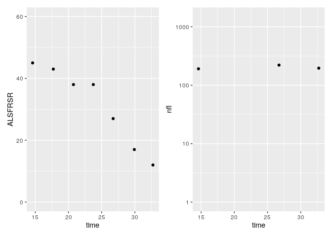

<!-- README.md is generated from README.Rmd. Please edit that file -->

# ALS\_clinical\_trials

<!-- badges: start -->

<!-- badges: end -->

The goal of ALS\_clinical\_trials is to …

``` r
library(tidyverse)
library(patchwork)
```

# Re-use data from our manuscript

This is a brief R tutorial on how to work with the data from our paper.

Read in the data (download from the *data* directory above, or from the
supplement of our
paper):

``` r
timepoints <- read_csv( "https://raw.githubusercontent.com/FelixTheStudent/ALS_clinical_trials/main/data/data_timepoints.csv")
patients <- read_csv( "https://raw.githubusercontent.com/FelixTheStudent/ALS_clinical_trials/main/data/data_patientInfo.csv" )
```

    #> Warning: Removed 4 rows containing missing values (geom_point).

<!-- -->

# Notes

You’ll still need to render `README.Rmd` regularly, to keep `README.md`
up-to-date. `devtools::build_readme()` is handy for this. You could also
use GitHub Actions to re-render `README.Rmd` every time you push. An
example workflow can be found here:
<https://github.com/r-lib/actions/tree/master/examples>.
