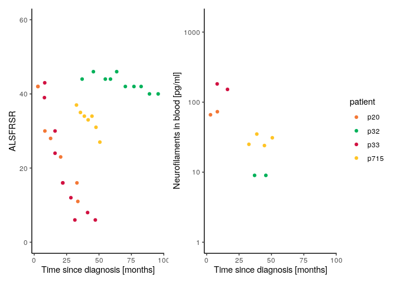

<!-- README.md is generated from README.Rmd. Please edit that file -->

# ALS\_clinical\_trials

<!-- badges: start -->

<!-- badges: end -->

The goal of ALS\_clinical\_trials is to …

``` r
library(tidyverse)
library(patchwork)
```

# Re-use data from our manuscript

This is a brief R tutorial on how to work with the data from our paper.

Read in the data (download from the *data* directory above, or from the
supplement of our
paper):

``` r
timepoints <- read_csv( "https://raw.githubusercontent.com/FelixTheStudent/ALS_clinical_trials/main/data/data_timepoints.csv")
patients <- read_csv( "https://raw.githubusercontent.com/FelixTheStudent/ALS_clinical_trials/main/data/data_patientInfo.csv" )
```

To illustrate how disease progression is correlated with our biomarker
(blood levels of neurofilament light chain, measured at time of
diagnosis), we visualize four selected patients:

``` r
patient_colors <- c("#00b159", "#ffc425", "#f37735", "#d11141");
names(patient_colors) <- c("p32", "p715", "p20", "p33")


df <- timepoints %>% filter(patient %in% c("p20", "p32", "p33", "p715" ))
df %>% ggplot(aes(time, ALSFRSR, col=patient))+geom_point() + ylim(c(0, 60)) + 
  scale_color_manual(values = patient_colors) + xlab("Time since diagnosis [months]")+
  theme_classic()+
df %>% ggplot(aes(time, nfl, col=patient))    +geom_point() + scale_y_log10(limits=c(1,1500)) +
  scale_color_manual(values = patient_colors) + xlab("Time since diagnosis [months]")+
  ylab("Neurofilaments in blood [pg/ml]")+ theme_classic() +
  plot_layout(guides="collect")
#> Warning: Removed 24 rows containing missing values (geom_point).
```

<!-- -->

This enables prediction of disease progression, increasing statistical
power in clinical ALS trials. More details can be found in our
manuscript:

> Simon Witzel and Felix Frauhammer *et al.*, 2021 (manuscript
> submitted)
